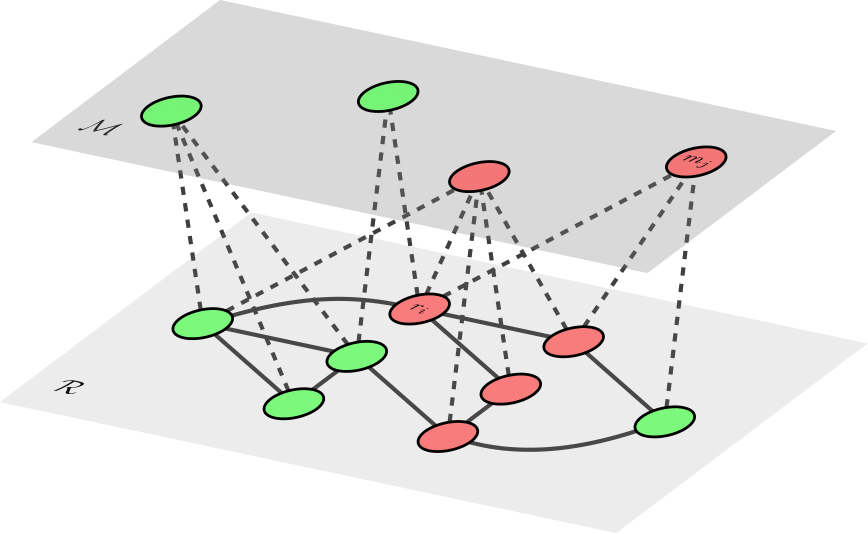

# NewsFlow

A co-evolving multilayer model of the flow of the news. 

<p align="center">
  
</p>

For further details about the model, its implementation, advantages and limitations, and empirical results, please refer to the original paper [[1]](#1).

## Prerequisites
The packages [`python-igraph`](https://igraph.org/python/) (version 0.7.1) and [`cyrandom`](https://pypi.org/project/cyrandom/) (version 0.3.1) must be installed in order to run the `NewsFlow`, which can be easily done with the [`pip`](https://pip.pypa.io/en/stable/) command:
```
$ pip install python-igraph
$ pip install cyrandom
```
(for troubleshooting, refer to the [python-igraph user manual](https://igraph.org/python/#pyinstall)).

## Installing
First, clone the git repository:
```
$ git clone https://github.com/ikicab/NewsFlow/
```
Then navigate to the downloaded folder and type the following commands into the terminal:
```
$ python setup.py build_ext --inplace
$ cython -a NewsFlow.pyx
```

## Usage

### Input parameters
The algorithm accepts the following input parameters – note that only the input graph `g`, the initial number `F0` of consumers of false news, the news-alignment rate `eta`, and the spreading rate of false news `lambda_F` are mandatory.

| Parameter name | Variable type | Description | Default value (if applicable) |
| --------- | ----------- | ----------- |----------- |
| `g` | `igraph.Graph` | population layer in the form of an (unweighted undirected) graph | 
| `F0` | `int` | initial number of consumers of false news |
| `eta` | `double` | rate of news-alignment (news-rewiring) |
| `lambda_F` | `double` | spreading rate of false news |
| `lambda_T` | `double` | spreading rate of true news | `1`
| `M` | `int` | number of media outlets that disseminate false/true news content; in total, there are `2*M` news providers | `10`
| `t_max` | `int` | upper limit on the simulation time (ignored if `0`) | `0`
| `window_size` | `int` | length of the sliding window over which the sample variance in the number of unbalanced (active) edges/polarised news consumers is computed (ignored if `0`) | `0` or `len(g.vs)` if `t_max == 0`
| `tol` | `double` | tolerance on the sliding-window variance (ignored if `window_size == 0`) | `0.02`
| `sfreq` | `int` | state-saving frequency | `0`

### Output parameters
Output parameters depend on the choice of `sfreq`; see below.

| Applicable if `sfreq` | Parameter name | Variable type | Description |
| --------- | --------- | ----------- | ----------- |
| `== 0` | `time_range` | `list` | time-step evolution
| `== 0` | `list_polarised` | `list` | detailed time evolution of the number of polarised individuals
| `== 0` | `list_rhoF` | `list` | detailed time evolution of the number of consumers of false news
| `== 0` | `list_FT_edges` | `list` | detailed time evolution of the number of unbalanced (active) edges
| `< 0` | `v_polarised` | `int` | final number of polarised individuals
| `< 0` | `rhoF` | `int` | final number of consumers of false news in the population
| `< 0` | `nFT_edges` | `int` | final number of unbalanced (active) edges
| `> 0` | `list_rhoF` | `list` | detailed time evolution (with a sampling frequency of `sfreq`) of the number of consumers of false news
| `> 0` | `X_Ymedia` | `dict` | detailed time evolution (with a sampling frequency of `sfreq`) of the number of media outlets that disseminate `Y` news content subscribed to by consumers of `X` news (with `X` and `Y` standing for true/false)
| `> 0` | `Xmedia_Y` | `dict` | detailed time evolution (with a sampling frequency of `sfreq`) of the number of consumers of `Y` news subscribed to media outlets that disseminate `X` news content (with `X` and `Y` standing for true/false)

### Visualisation
A selection of dedicated visualisation tools may be found in the accompanying `Python` script `VisualTools` (refer also to the [Tutorial](https://nbviewer.jupyter.org/github/ikicab/NewsFlow/blob/master/Tutorial.ipynb)).

## Tutorial
See the [Tutorial](https://nbviewer.jupyter.org/github/ikicab/NewsFlow/blob/master/Tutorial.ipynb) for more help and examples.

## References
<a id="1">[1]</a>
*In preparation*.

The figure above was prepared with the [`LaTeX`](https://www.latex-project.org/) drawing package [`tikz-network`](https://github.com/hackl/tikz-network).
